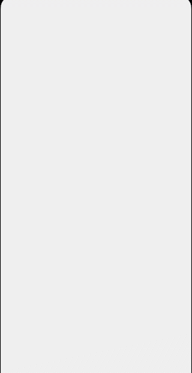

# TestPizza
Главный экран приложения для доставки еды.

# Описание

На главном экране представлены список с банерами и список с доступными товарами с переключением между категориями через chip.

    
 
При отсутствии подключения к интернету загружаются сохраненные ранее данные.
 
 
 
# Структура
 
В качестве архитектурного паттерна используется Clean Architecture с MVVM. Анимация при скролле реализована с помощью MotionLayout. 
Также используются следующие библиотеки: для многопоточности Coroutines, для работы с базой данных Room, для загрузки и кэширования изображений Glide, а также Koin для DI.
